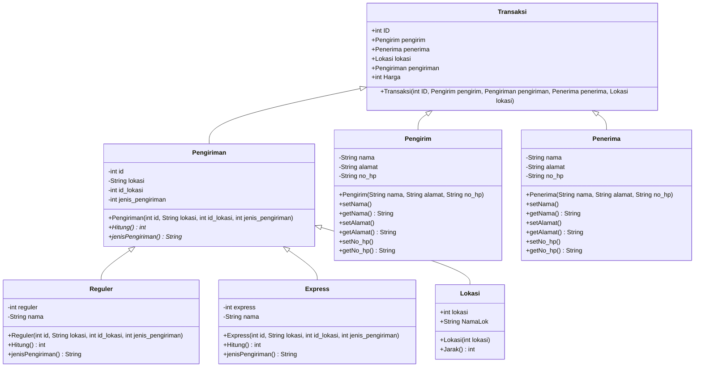

# Final Project PBO - Dari Lampung Untuk Lampung

Daud Maranatha Purba 1917051042

Adrian Septa Yoka 1917051043

Achmad Romadoni 1917051055

Untuk pembagian tugas Final Project dikerjakan bersama-sama

### Class Diagram


### ER Diagram
```mermaid
erDiagram
          PENGIRIMAN ||--|| REGULER : is
          PENGIRIMAN ||--|| EXPRESS : is
          PENGIRIMAN }|--|| LOKASI : to
          TRANSAKSI ||--|| PENGIRIMAN : has
          TRANSAKSI }|..|| PENGIRIM : do
          TRANSAKSI }|--|| PENERIMA : do

          PENGIRIMAN{
            int id
            String lokasi
            int id_lokasi
            int jenis_pengiriman
          }

          REGULER{
            int reguler
            String nama
          }

          EXPRESS{
            int express
            String nama
          }

          LOKASI{
            int lokasi
            String NamaLok
          }

          PENGIRIM{
            String nama
            String alamat
            String no_hp
          }

          PENERIMA{
            String nama
            String alamat
            String no_hp
          }

          TRANSAKSI{
            int ID
            Pengirim pengirim
            Penerima penerima
            Lokasi lokasi
            Pengiriman pengiriman
            int Harga
          }
```
